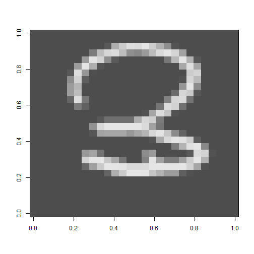

```r
library(party)
```

```
## Loading required package: grid
```

```
## Loading required package: mvtnorm
```

```
## Loading required package: modeltools
```

```
## Loading required package: stats4
```

```
## Loading required package: strucchange
```

```
## Loading required package: zoo
```

```
## 
## Attaching package: 'zoo'
```

```
## The following objects are masked from 'package:base':
## 
##     as.Date, as.Date.numeric
```

```
## Loading required package: sandwich
```

```r
library(randomForest)
```

```
## randomForest 4.6-12
```

```
## Type rfNews() to see new features/changes/bug fixes.
```

```r
library(rattle)
```

```
## Rattle: A free graphical interface for data mining with R.
## Version 4.1.0 Copyright (c) 2006-2015 Togaware Pty Ltd.
## Type 'rattle()' to shake, rattle, and roll your data.
```

```r
library(rpart)
library(caret)
```

```
## Loading required package: lattice
```

```
## Loading required package: ggplot2
```

```
## 
## Attaching package: 'ggplot2'
```

```
## The following object is masked from 'package:randomForest':
## 
##     margin
```

```r
library(dplyr)
```

```
## 
## Attaching package: 'dplyr'
```

```
## The following object is masked from 'package:randomForest':
## 
##     combine
```

```
## The following objects are masked from 'package:stats':
## 
##     filter, lag
```

```
## The following objects are masked from 'package:base':
## 
##     intersect, setdiff, setequal, union
```

```r
library(lattice)
library(Hmisc)
```

```
## Loading required package: survival
```

```
## 
## Attaching package: 'survival'
```

```
## The following object is masked from 'package:caret':
## 
##     cluster
```

```
## Loading required package: Formula
```

```
## 
## Attaching package: 'Hmisc'
```

```
## The following objects are masked from 'package:dplyr':
## 
##     combine, src, summarize
```

```
## The following object is masked from 'package:randomForest':
## 
##     combine
```

```
## The following objects are masked from 'package:base':
## 
##     format.pval, round.POSIXt, trunc.POSIXt, units
```

```r
setwd("C:/Onur_Data/Folder/DATA SCIENCE/digit recognizer/data")

test<-read.csv("test.csv",header = TRUE,na.strings = c("NA",""))
train<-read.csv("train.csv",header = TRUE,na.strings = c("NA",""))


  a<-train[8,]
  a<-as.matrix(a)
  m = matrix(a,28,28)
```

```
## Warning in matrix(a, 28, 28): data length [785] is not a sub-multiple or
## multiple of the number of rows [28]
```

```r
  image(m,col=grey.colors(255))
```



```r
  dx<-matrix(ncol=28,nrow=28)
  for(r in 28:1){
    for(c in 1:28){
      dat<-(r-1)*28+c+1
      dx[r,c]<-train[8,dat]
    }
  }
  print(dx,max.levels=28)
```

```
##       [,1] [,2] [,3] [,4] [,5] [,6] [,7] [,8] [,9] [,10] [,11] [,12] [,13]
##  [1,]    0    0    0    0    0    0    0    0    0     0     0     0     0
##  [2,]    0    0    0    0    0    0    0    0    0     0     0     0     0
##  [3,]    0    0    0    0    0    0    0    0    0     0     0     0     0
##  [4,]    0    0    0    0    0    0    0    0    0     0     0     0     0
##  [5,]    0    0    0    0    0    0    0    0    0     0     0     0     0
##  [6,]    0    0    0    0    0    0    0    0    0     0     0     0     0
##  [7,]    0    0    0    0    0    0    0    0    0    21   130   190   254
##  [8,]    0    0    0    0    0    0   26  102  186   254   254   248   222
##  [9,]    0    0    0    0    0    0  207  254  254   177   117    39     0
## [10,]    0    0    0    0    0    0   91  111   36     0     0     0     0
## [11,]    0    0    0    0    0    0    0    0    0     0     0     0     0
## [12,]    0    0    0    0    0    0    0    0    0     0     0     0     0
## [13,]    0    0    0    0    0    0    0    8  107   112   112   112    87
## [14,]    0    0    0    0    0    0    0   77  221   254   254   254   254
## [15,]    0    0    0    0    0    0    0    0   10    32    32    32    32
## [16,]    0    0    0    0    0    0    0    0    0     0     0     0     0
## [17,]    0    0    0    0    0   47   18    0    0     0     0     0     0
## [18,]    0    0    0    0   22  234   42    0    0     0     0     0     0
## [19,]    0    0    0    0   96  157    0    0    0     0     0     0     0
## [20,]    0    0    0    0   96  142    0    0    0     0     0     0     0
## [21,]    0    0    0    0   71  202   15    0    0     0     0     0     0
## [22,]    0    0    0    0   10  231   86    2    0     0     0     0     0
## [23,]    0    0    0    0    0   93  248  129    7     0     0     0     0
## [24,]    0    0    0    0    0    0   94  248  209    73    12     0     0
## [25,]    0    0    0    0    0    0    0   48  160   215   230   158    74
## [26,]    0    0    0    0    0    0    0    0    0    11   129   189   234
## [27,]    0    0    0    0    0    0    0    0    0     0     0     0     0
## [28,]    0    0    0    0    0    0    0    0    0     0     0     0     0
##       [,14] [,15] [,16] [,17] [,18] [,19] [,20] [,21] [,22] [,23] [,24]
##  [1,]     0     0     0     0     0     0     0     0     0     0     0
##  [2,]     0     0     0     0     0     0     0     0     0     0     0
##  [3,]     0     0     0     0     0     0     0     0     0     0     0
##  [4,]     0     0     0     0     0     0     0     0     0     0     0
##  [5,]     0     0     0     0     0     0     0     0     0     0     0
##  [6,]     0     0     0     0     0     0     0     0     0     0     0
##  [7,]   254   250   175   135    96    96    16     4     0     0     0
##  [8,]   222   225   254   254   254   254   254   206   112     4     0
##  [9,]     0    56   248   102    48    48   103   192   254   135     0
## [10,]     0    72    92     0     0     0     0    12   224   210     5
## [11,]     0     0     0     0     0    50   139   240   254    66     0
## [12,]     0     0     7   121   220   254   244   194    15     0     0
## [13,]   112   141   218   248   177    68    20     0     0     0     0
## [14,]   254   225   104    39     0     0     0     0     0     0     0
## [15,]   130   215   195    47     0     0     0     0     0     0     0
## [16,]     0     6   111   231   174     5     0     0     0     0     0
## [17,]     0     0     0    40   228   205    35     0     0     0     0
## [18,]     0     0     0     0    56   212   226    38     0     0     0
## [19,]     0     0     0     0     0    30   215   188     9     0     0
## [20,]     0     0     0     0     0     0    86   254    68     0     0
## [21,]     0     0     0     0     0     0     6   214   151     0     0
## [22,]     0     0     0     0     0     0     0   191   207     0     0
## [23,]     0     0     0     0     0     0   117   238   112     0     0
## [24,]     0     0     0     0    42   147   252   136     9     0     0
## [25,]    64    94   153   223   250   214   105     0     0     0     0
## [26,]   224   255   194   134    75     6     0     0     0     0     0
## [27,]     0     0     0     0     0     0     0     0     0     0     0
## [28,]     0     0     0     0     0     0     0     0     0     0     0
##       [,25] [,26] [,27] [,28]
##  [1,]     0     0     0     0
##  [2,]     0     0     0     0
##  [3,]     0     0     0     0
##  [4,]     0     0     0     0
##  [5,]     0     0     0     0
##  [6,]     0     0     0     0
##  [7,]     0     0     0     0
##  [8,]     0     0     0     0
##  [9,]     0     0     0     0
## [10,]     0     0     0     0
## [11,]     0     0     0     0
## [12,]     0     0     0     0
## [13,]     0     0     0     0
## [14,]     0     0     0     0
## [15,]     0     0     0     0
## [16,]     0     0     0     0
## [17,]     0     0     0     0
## [18,]     0     0     0     0
## [19,]     0     0     0     0
## [20,]     0     0     0     0
## [21,]     0     0     0     0
## [22,]     0     0     0     0
## [23,]     0     0     0     0
## [24,]     0     0     0     0
## [25,]     0     0     0     0
## [26,]     0     0     0     0
## [27,]     0     0     0     0
## [28,]     0     0     0     0
```


