 **VARIABLE DESCRIPTIONS: **


survival        :Survival

                (0 = No; 1 = Yes)
                
pclass          :Passenger Class

                (1 = 1st; 2 = 2nd; 3 = 3rd)
                
name            :Name

sex             :Sex

age             :Age

sibsp           :Number of Siblings/Spouses Aboard

parch           :Number of Parents/Children Aboard

ticket          :Ticket Number

fare            :Passenger Fare

cabin           :Cabin

embarked        :Port of Embarkation

                (C = Cherbourg; Q = Queenstown; S = Southampton)
                

 **SPECIAL NOTES: **
Pclass is a proxy for socio-economic status (SES)

 1st ~ Upper; 2nd ~ Middle; 3rd ~ Lower

Age is in Years; Fractional if Age less than One (1)

 If the Age is Estimated, it is in the form xx.5

With respect to the family relation variables (i.e. sibsp and parch)
some relations were ignored.  The following are the definitions used
for sibsp and parch.

Sibling:  Brother, Sister, Stepbrother, or Stepsister of Passenger Aboard Titanic

Spouse:   Husband or Wife of Passenger Aboard Titanic (Mistresses and Fiances
Ignored)

Parent:   Mother or Father of Passenger Aboard Titanic

Child:    Son, Daughter, Stepson, or Stepdaughter of Passenger Aboard Titanic


Other family relatives excluded from this study include cousins,
nephews/nieces, aunts/uncles, and in-laws.  Some children travelled
only with a nanny, therefore parch=0 for them.  As well, some
travelled with very close friends or neighbors in a village, however,
the definitions do not support such relations.

 **Getting Data  **


```r
library(party)
library(randomForest)
library(rattle)
library(rpart)
library(caret)
library(dplyr)
library(lattice)
library(Hmisc)
setwd("C:/Onur_Data/Folder/DATA SCIENCE/titanic")

test<-read.csv("test.csv",header = TRUE,na.strings = c("NA",""))
train<-read.csv("train.csv",header = TRUE,na.strings = c("NA",""))
genderclassmodel<-read.csv("genderclassmodel.csv",header = TRUE,na.strings = c("NA",""))
gendermodel<-read.csv("gendermodel.csv",header = TRUE,na.strings = c("NA",""))
alldata<- bind_rows(train,test)
```


 **Finding NA Amounts with Loop Functions **


```r
c<-data.frame(V1=character(), 
                     V2=character(),
                     V3=character(),
                     stringsAsFactors=FALSE)
for(i in 1:length(names(train))){
    c[i,2]<-sum(is.na(train[,i]))}
for(i in 1:length(names(alldata))){
    c[i,3]<-sum(is.na(alldata[,i]))}

c$V1<-names(train)
names(c)<-c("feature","Train NA-Counts","ALL NA-Counts")
c
```

```
##        feature Train NA-Counts ALL NA-Counts
## 1  PassengerId               0             0
## 2     Survived               0           418
## 3       Pclass               0             0
## 4         Name               0             0
## 5          Sex               0             0
## 6          Age             177           263
## 7        SibSp               0             0
## 8        Parch               0             0
## 9       Ticket               0             0
## 10        Fare               0             1
## 11       Cabin             687          1014
## 12    Embarked               2             2
```

 **Dealing with NAs **


```r
meanage<-mean(alldata$Age,na.rm = TRUE)
meanage
```

```
## [1] 29.88114
```

```r
train[is.na(train$Age),6]<-meanage
train$farecut<-cut2(train$Fare,c(125,250,375))
test$farecut<-cut2(test$Fare,c(125,250,375))
which(is.na(train$Embarked))
```

```
## [1]  62 830
```

```r
train[c(62,830),12]<-"S"
```


 **Visualizing **  
 

```r
histogram( ~Survived,train,breaks=seq(from=-.5,to=1.5,by=1),xlim = c(-.5,1.5))
```

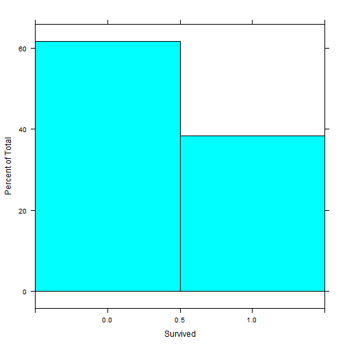

```r
histogram( ~Survived|factor(Sex),train,breaks=seq(from=-.5,to=1.5,by=1),xlim = c(-.5,1.5))
```

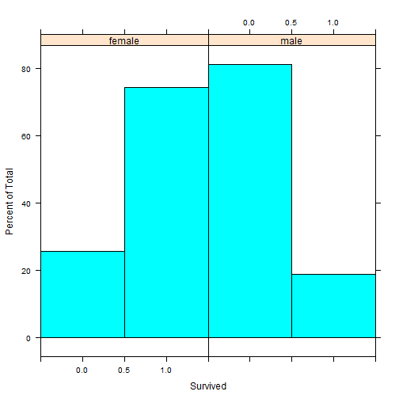

```r
histogram( ~Pclass|factor(Sex)+factor(Survived),train)
```

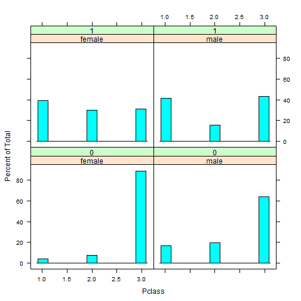

```r
histogram( ~Age|factor(Sex)+factor(Survived),train)
```

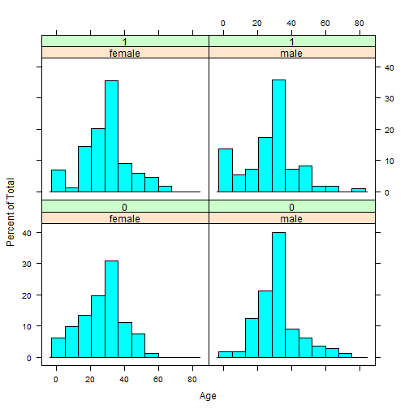

```r
histogram( ~SibSp|factor(Sex)+factor(Survived),train)
```

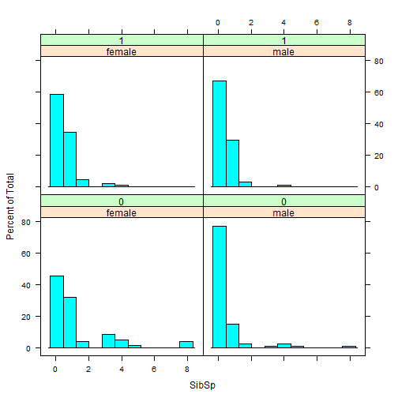

```r
histogram( ~Parch|factor(Sex)+factor(Survived),train)
```

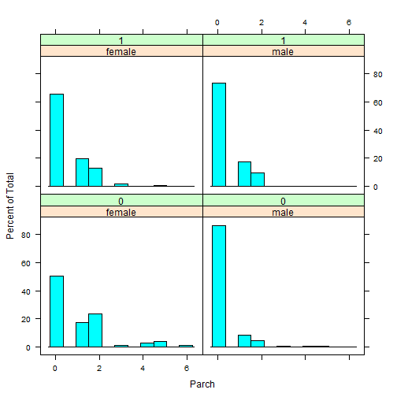

```r
histogram( ~Fare|factor(Sex)+factor(Survived),train)
```

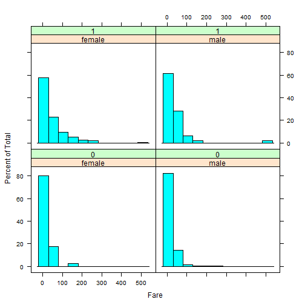

```r
histogram( ~Embarked|factor(Sex)+factor(Survived),train)
```

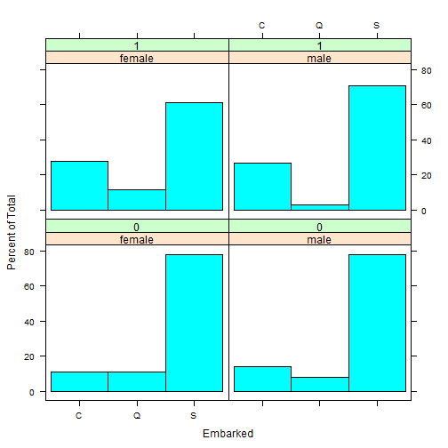

```r
histogram( ~Embarked|factor(farecut)+factor(Survived),train)
```

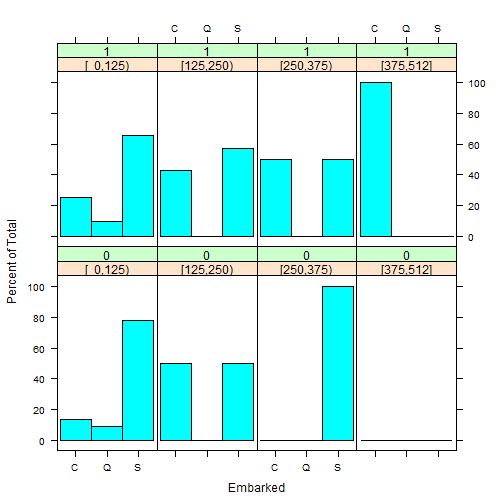

```r
histogram( ~Embarked|factor(Pclass)+factor(Survived),train)
```

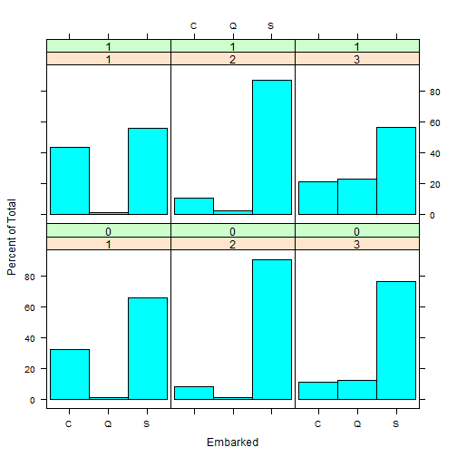


**Modelling**

*Principal component analysis*

```r
pairs(train[,c(3,6,7,8,10)])
```

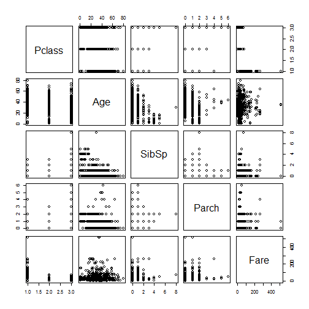

```r
pca<-princomp(train[,c(3,6,7,8,10)],cor = TRUE,scores = TRUE)
plot(pca)
```

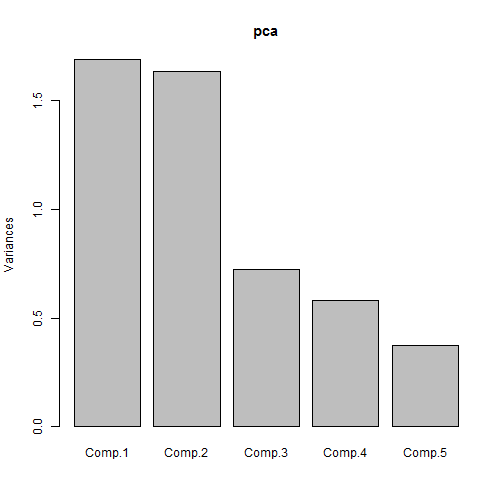

```r
biplot(pca)
```

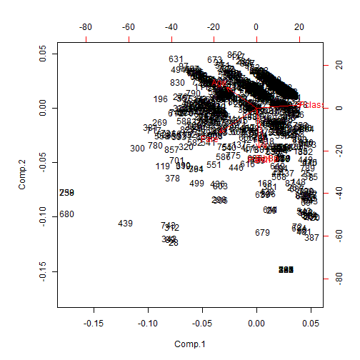

```r
pca$loadings
```

```
## 
## Loadings:
##        Comp.1 Comp.2 Comp.3 Comp.4 Comp.5
## Pclass  0.680        -0.187         0.705
## Age    -0.452  0.321 -0.804         0.202
## SibSp   0.126 -0.612 -0.278  0.722 -0.108
## Parch         -0.619 -0.358 -0.687 -0.119
## Fare   -0.562 -0.369  0.336         0.660
## 
##                Comp.1 Comp.2 Comp.3 Comp.4 Comp.5
## SS loadings       1.0    1.0    1.0    1.0    1.0
## Proportion Var    0.2    0.2    0.2    0.2    0.2
## Cumulative Var    0.2    0.4    0.6    0.8    1.0
```

```r
head(pca$scores)
```

```
##          Comp.1      Comp.2      Comp.3      Comp.4     Comp.5
## [1,]  1.1518624  0.06776561  0.20496867  0.55643771  0.1414003
## [2,] -1.7575969 -0.14293467  0.09475608  0.75474185 -0.4469826
## [3,]  0.8908999  0.71690030  0.21405438 -0.07602714  0.3105895
## [4,] -1.4475922 -0.08201736  0.15740033  0.73334348 -0.7353232
## [5,]  0.5764344  0.93813665 -0.34204744 -0.02637265  0.4524423
## [6,]  0.7498686  0.80874723 -0.02251462 -0.05448619  0.3781317
```

```r
pca <- preProcess(train[,c(3,6,7,8,10)], 
                   method=c( "center", 
                     "scale", "pca"))
pc<- predict(pca, train[,c(3,6,7,8,10)])
print(pca)
```

```
## Created from 891 samples and 5 variables
## 
## Pre-processing:
##   - centered (5)
##   - ignored (0)
##   - principal component signal extraction (5)
##   - scaled (5)
## 
## PCA needed 5 components to capture 95 percent of the variance
```

```r
summary(pca)
```

```
##            Length Class  Mode    
## dim         2     -none- numeric 
## bc          0     -none- NULL    
## yj          0     -none- NULL    
## et          0     -none- NULL    
## mean        5     -none- numeric 
## std         5     -none- numeric 
## ranges      0     -none- NULL    
## rotation   25     -none- numeric 
## method      4     -none- list    
## thresh      1     -none- numeric 
## pcaComp     0     -none- NULL    
## numComp     1     -none- numeric 
## ica         0     -none- NULL    
## wildcards   2     -none- list    
## k           1     -none- numeric 
## knnSummary  1     -none- function
## bagImp      0     -none- NULL    
## median      0     -none- NULL    
## data        0     -none- NULL
```

```r
plot(pc)
```


*Decision Tree*

```r
fit<-rpart(Survived~Pclass+Sex+Age+SibSp+Parch+farecut+Embarked,data = train)
fancyRpartPlot(fit)
```

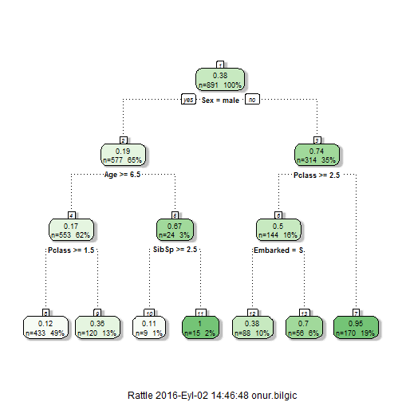

```r
pred<-round(predict(fit,test))
confusionMatrix(pred,genderclassmodel$Survived)
```

```
## Confusion Matrix and Statistics
## 
##           Reference
## Prediction   0   1
##          0 270  31
##          1   7 110
##                                           
##                Accuracy : 0.9091          
##                  95% CI : (0.8774, 0.9349)
##     No Information Rate : 0.6627          
##     P-Value [Acc > NIR] : < 2.2e-16       
##                                           
##                   Kappa : 0.7878          
##  Mcnemar's Test P-Value : 0.0001907       
##                                           
##             Sensitivity : 0.9747          
##             Specificity : 0.7801          
##          Pos Pred Value : 0.8970          
##          Neg Pred Value : 0.9402          
##              Prevalence : 0.6627          
##          Detection Rate : 0.6459          
##    Detection Prevalence : 0.7201          
##       Balanced Accuracy : 0.8774          
##                                           
##        'Positive' Class : 0               
## 
```

*Random Forest*

```r
set.seed(313)
fitrf<-randomForest(as.factor(Survived)~Pclass+Sex+Age+SibSp+Parch+Fare,data = train,ntree=2000,importance=TRUE)
print(fitrf) 
```

```
## 
## Call:
##  randomForest(formula = as.factor(Survived) ~ Pclass + Sex + Age +      SibSp + Parch + Fare, data = train, ntree = 2000, importance = TRUE) 
##                Type of random forest: classification
##                      Number of trees: 2000
## No. of variables tried at each split: 2
## 
##         OOB estimate of  error rate: 17.28%
## Confusion matrix:
##     0   1 class.error
## 0 496  53  0.09653916
## 1 101 241  0.29532164
```

```r
print(importance(fitrf,type = 2)) 
```

```
##        MeanDecreaseGini
## Pclass         34.37196
## Sex           107.68303
## Age            56.58102
## SibSp          16.66850
## Parch          12.32282
## Fare           68.32900
```

```r
pred2<-predict(fitrf,test)
confusionMatrix(pred2,genderclassmodel$Survived)
```

```
## Confusion Matrix and Statistics
## 
##           Reference
## Prediction   0   1
##          0 193  18
##          1  17 103
##                                          
##                Accuracy : 0.8943         
##                  95% CI : (0.856, 0.9252)
##     No Information Rate : 0.6344         
##     P-Value [Acc > NIR] : <2e-16         
##                                          
##                   Kappa : 0.7716         
##  Mcnemar's Test P-Value : 1              
##                                          
##             Sensitivity : 0.9190         
##             Specificity : 0.8512         
##          Pos Pred Value : 0.9147         
##          Neg Pred Value : 0.8583         
##              Prevalence : 0.6344         
##          Detection Rate : 0.5831         
##    Detection Prevalence : 0.6375         
##       Balanced Accuracy : 0.8851         
##                                          
##        'Positive' Class : 0              
## 
```

```r
varImpPlot(fitrf)
```

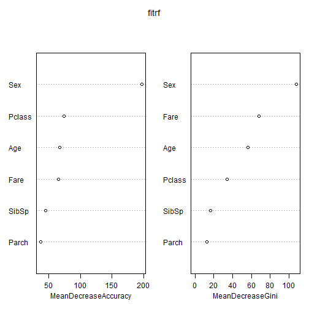
